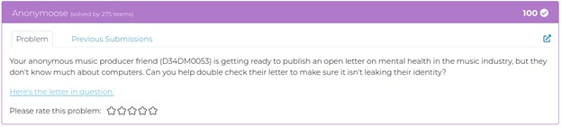
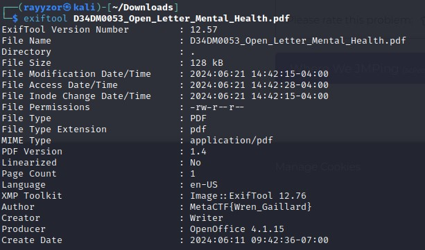

<h1>Challenge 1 - Forensics</h1>

  
  
Challenge description.

 

  
The file given to us is a pdf file. The hint is to check if the document is not revealing any identity. The first guess is metadata,
    what is metadata? Metadata, in short, is data about data. It provides information about the data that is being accessed. For instance in this case, 
    the pdf document is being accessed, hence the size of the file, last modified date, software used to generate it and many more is considered as metadata. 
    Metadata is crucial in cybersecurity, because many times metadata reveal sensitive information about organizations, users, and devices. Use exiftool 
    to reveal metadata of files.

 

  
  
Flag revealed.

 

Flag: MetaCTF{Wren_Gaillard}

