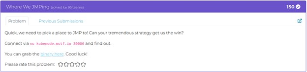
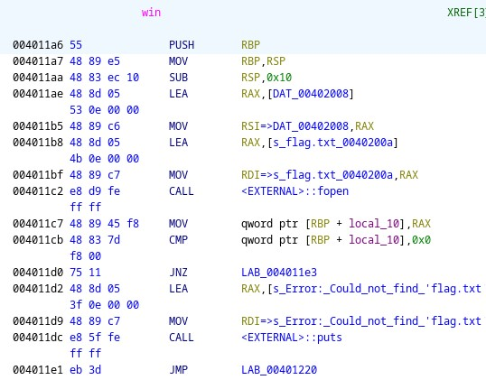
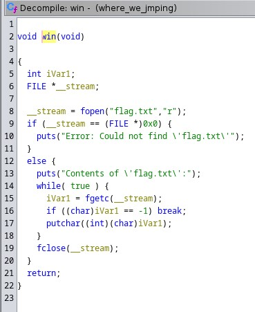
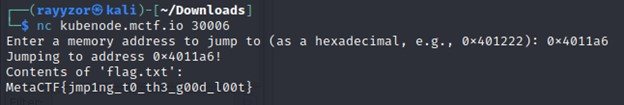

<h1>Challenge 2 - Binary Exploitation.</h1>

  
  
Challenge description.

 

  
When connected to the netcat connection, the program asks for a memory address. Provide an address in hex format and the code jumps to that address. 
    We are given the elf binary file of the program to analyze. Used Ghidra to analyze the code.

 

  
  
Assembly language code of the function win().

 

  
  
C language code of the function win().

 

  
After analyzing the code, there is a function called win(). The function reads the file flag.txt and prints the content of it. 
    The function call is at address 0x4011a6. Since the program jumps to the provided address, try inputting the win function address. 
    This will call the win function.

 

  
  
Flag revealed.

  
Flag: MetaCTF{jmp1ng_t0_th3_g00d_l00t}

